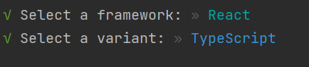

# Basics of reactjs

Referencing to [React Tutorial For Beginners](https://www.youtube.com/watch?v=SqcY0GlETPk)

React is javascript library for **building dynamic and interactive user interfaces** 
- Using small reusable components and react will take care of updating DOM elements

Prerequisites 
- Ensure that Node is installed in the PC (at least v16)

In the Terminal 
npm create vite@4.1.0

cd react-app 
npm i

node_modules 
- Third party libraries, react and other tools are installed

Public 
- public assets for the website exists, for examples images for the site

Src
- source code for the application

Install bootstrap 
npm i bootstrap@5.2.3